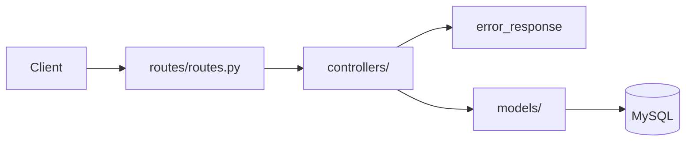

# Flask App v2

v2 在 v1 的基礎上重構為 **Flask Blueprint + MVC** 架構，並將資料持久化至 **MySQL**（PyMySQL）。所有 API 前綴為 `/api/v2`，且僅使用 **GET** 與 **POST** 兩種 HTTP 方法。

**Dead line:** 6/29(一)，有問題請及早提出！

---

## Project structure

```bash
flask_app/
├── app.py                  # v2 啟動入口
├── app_v1.py               # v1 舊版（保留）
├── boot.sh                 # v2 啟動腳本（port 8080）
├── .python-version         # Python 版本（3.14.5）
├── .env.example            # 環境變數範本（可選）
├── migrations/init.sql     # 資料庫建表腳本
├── requirements.txt
└── src/
    ├── __init__.py         # create_app() 工廠
    ├── configs/
    │   └── config.py       # 應用設定
    ├── routes/
    │   └── routes.py       # 全部路由註冊（Blueprint）
    ├── controllers/        # C：業務邏輯 + HTTP 處理
    │   ├── health_controller.py
    │   ├── product_controller.py
    │   └── user_controller.py
    ├── models/             # M：資料存取層
    │   ├── database.py     # PyMySQL 連線
    │   ├── product.py
    │   └── user.py
    └── functions/
        └── response.py     # 統一 JSON 回應格式
```

## Flow



路由採用集中註冊，範例：

```python
route.route("/healthCheck", methods=["GET"])(healthContr.health_check)
route.route("/products", methods=["POST"])(productContr.create_product)
```

---

## v1 vs v2 差異

| 項目           | v1 (`app_v1.py`)   | v2 (`app.py`)               |
| -------------- | ------------------ | --------------------------- |
| 架構           | 單檔 monolith      | Blueprint + MVC 分層        |
| 資料儲存       | 記憶體 dict        | MySQL                       |
| API 前綴       | 無                 | `/api/v2`                   |
| 產品／用戶管理 | 商品查詢、會員註冊 | 完整 CRUD                   |
| HTTP 方法      | GET / POST         | GET / POST                  |
| HTTP 狀態碼    | 多數回 200         | 200 / 201 / 400 / 404 / 409 |

---

## New features

### 1. 產品管理（Products）

- 列出、查詢、新增、更新、刪除產品
- 支援依名稱模糊搜尋、價格區間篩選（`min_price`、`max_price`）
- 欄位：`name`、`price`、`description`、`stock`

### 2. 用戶管理（Users）

- 列出、查詢、新增、更新、刪除用戶
- 支援依 `name`、`email`、`phone` 模糊搜尋
- Email 唯一性檢查與格式驗證

### 3. 基礎建設

- App Factory 模式（`create_app()`）
- 環境變數支援（`.env`，可選）
- 統一 JSON 回應格式
- 請求週期內自動管理 DB 連線（`teardown_appcontext`）

---

## Quickly start

### 前置需求

- Python 3.14.5（見 `.python-version`）
- MySQL 8.x

### 安裝與啟動

```bash
# 1. 建立虛擬環境並安裝依賴
python3 -m venv .venv
source .venv/bin/activate
pip install -r requirements.txt

# 2.（可選）設定環境變數
cp .env.example .env
# 若本機 MySQL 與預設值不同，再編輯 .env

# 3. 初始化資料庫（也可複製 SQL 到 Workbench 執行）
mysql -u root -p < migrations/init.sql

# 4. 啟動服務
chmod +x boot.sh
./boot.sh
```

服務啟動後：

- 預設位址：`http://localhost:8080`
- 日誌寫入：`logs/api.log`

也可直接執行（預設 port **5000**）：

```bash
python app.py
```

---

## Environment variables

`.env` **不是必須**。未設定時會使用 `src/configs/config.py` 的預設值。

| 變數             | 說明         | 預設值      |
| ---------------- | ------------ | ----------- |
| `MYSQL_HOST`     | MySQL 主機   | `127.0.0.1` |
| `MYSQL_PORT`     | MySQL 埠號   | `3306`      |
| `MYSQL_USER`     | MySQL 使用者 | `root`      |
| `MYSQL_PASSWORD` | MySQL 密碼   | （空）      |
| `MYSQL_DATABASE` | 資料庫名稱   | `MyShop`    |

> `MYSQL_DATABASE` 需與 `migrations/init.sql` 建立的資料庫名稱一致。

---

## Response format

### 成功

```json
{
  "success": true,
  "message": "Products retrieved successfully",
  "data": []
}
```

### 失敗

```json
{
  "success": false,
  "message": "Product not found"
}
```

---

## API Reference

Base URL：`http://localhost:8080/api/v2`

### 端點總覽

| 方法 | 路徑                            | 說明         |
| ---- | ------------------------------- | ------------ |
| GET  | `/healthCheck`                  | 健康檢查     |
| GET  | `/products/list`                     | 列出產品     |
| GET  | `/products/search-by-id/<product_id>`        | 取得單一產品 |
| POST | `/products/create`                     | 新增產品     |
| POST | `/products/update-by-id/<product_id>`        | 更新產品     |
| POST | `/products/<product_id>/delete` | 刪除產品     |
| GET  | `/users`                        | 列出用戶     |
| GET  | `/users/<user_id>`              | 取得單一用戶 |
| POST | `/users`                        | 新增用戶     |
| POST | `/users/<user_id>`              | 更新用戶     |
| POST | `/users/<user_id>/delete`       | 刪除用戶     |

---

### Health Check

#### `GET /healthCheck`

檢查服務是否正常運作。

**Response `200`：**

```json
{
  "success": true,
  "message": "I am healthy!",
  "version": "v2"
}
```

---

### Products

#### `GET /products`

列出所有產品，支援 Query String 篩選。

| 參數         | 類型   | 說明                 |
| ------------ | ------ | -------------------- |
| `name`       | string | 名稱模糊搜尋         |
| `product_id` | number | 特定產品 ID搜尋      |
| `price`      | string | 支援 >=, <= 區段查詢 |

**Response `200`：**

```json
{
  "success": true,
  "message": "Products retrieved successfully",
  "data": [
    {
      "id": 1,
      "name": "apple",
      "price": 20.0,
      "description": "Fresh red apple",
      "stock": 100,
      "created_at": "2026-06-17T10:00:00",
      "updated_at": "2026-06-17T10:00:00"
    }
  ]
}
```

#### `GET /products/<product_id>`

取得單一產品。找不到回 `404`。

#### `POST /products`

新增產品。成功回 `201`。

**Request：**

```json
{
  "name": "grape",
  "price": 350,
  "description": "Sweet grape",
  "stock": 50
}
```

| 欄位          | 必填 | 說明               |
| ------------- | ---- | ------------------ |
| `name`        | 是   | 產品名稱           |
| `price`       | 是   | 價格（不可為負數） |
| `description` | 否   | 描述               |
| `stock`       | 否   | 庫存，預設 `0`     |

#### `POST /products/<product_id>`

更新產品，可只傳需要修改的欄位。找不到回 `404`。

**Request：**

```json
{
  "price": 380,
  "stock": 40
}
```

#### `POST /products/<product_id>/delete`

刪除產品。找不到回 `404`。

---

### Users

#### `GET /users`

列出所有用戶，支援 Query String 篩選。

| 參數    | 類型   | 說明           |
| ------- | ------ | -------------- |
| `name`  | string | 名稱模糊搜尋   |
| `email` | string | Email 模糊搜尋 |
| `phone` | string | 電話模糊搜尋   |

**Response `200`：**

```json
{
  "success": true,
  "message": "Users retrieved successfully",
  "data": [
    {
      "id": 1,
      "name": "Mary",
      "email": "mary@example.com",
      "phone": "0912345678",
      "created_at": "2026-06-17T10:00:00",
      "updated_at": "2026-06-17T10:00:00"
    }
  ]
}
```

#### `GET /users/<user_id>`

取得單一用戶。找不到回 `404`。

#### `POST /users`

新增用戶。成功回 `201`，Email 重複回 `409`。

**Request：**

```json
{
  "name": "Mary",
  "email": "mary@example.com",
  "phone": "0912345678"
}
```

| 欄位    | 必填 | 說明                      |
| ------- | ---- | ------------------------- |
| `name`  | 是   | 用戶名稱                  |
| `email` | 是   | Email（唯一、需符合格式） |
| `phone` | 否   | 電話                      |

#### `POST /users/<user_id>`

更新用戶，可只傳需要修改的欄位。找不到回 `404`，Email 與他人重複回 `409`。

#### `POST /users/<user_id>/delete`

刪除用戶。找不到回 `404`。

---

## curl 範例

```bash
# 健康檢查
curl http://localhost:8080/api/v2/healthCheck

# 列出產品
curl http://localhost:8080/api/v2/products

# 依名稱搜尋產品
curl "http://localhost:8080/api/v2/products?name=apple"

# 依價格區間篩選
curl "http://localhost:8080/api/v2/products?price>=20"

# 取得單一產品
curl http://localhost:8080/api/v2/products/1

# 新增產品
curl -X POST http://localhost:8080/api/v2/products \
  -H "Content-Type: application/json" \
  -d '{"name": "kiwi", "price": 75, "stock": 30}'

# 更新產品
curl -X POST http://localhost:8080/api/v2/products/1 \
  -H "Content-Type: application/json" \
  -d '{"price": 80, "stock": 25}'

# 刪除產品
curl -X POST http://localhost:8080/api/v2/products/1/delete

# 新增用戶
curl -X POST http://localhost:8080/api/v2/users \
  -H "Content-Type: application/json" \
  -d '{"name": "Mary", "email": "mary@example.com", "phone": "0912345678"}'

# 更新用戶
curl -X POST http://localhost:8080/api/v2/users/1 \
  -H "Content-Type: application/json" \
  -d '{"phone": "0987654321"}'

# 刪除用戶
curl -X POST http://localhost:8080/api/v2/users/1/delete
```

---

## Database schema

`migrations/init.sql` 會建立資料庫 `MyShop` 及以下資料表：

**products**

| 欄位          | 類型          | 說明     |
| ------------- | ------------- | -------- |
| `id`          | INT           | 主鍵     |
| `name`        | VARCHAR(100)  | 產品名稱 |
| `price`       | DECIMAL(10,2) | 價格     |
| `description` | TEXT          | 描述     |
| `stock`       | INT           | 庫存     |
| `created_at`  | TIMESTAMP     | 建立時間 |
| `updated_at`  | TIMESTAMP     | 更新時間 |

**users**

| 欄位         | 類型         | 說明          |
| ------------ | ------------ | ------------- |
| `id`         | INT          | 主鍵          |
| `name`       | VARCHAR(100) | 用戶名稱      |
| `email`      | VARCHAR(255) | Email（唯一） |
| `phone`      | VARCHAR(20)  | 電話          |
| `created_at` | TIMESTAMP    | 建立時間      |
| `updated_at` | TIMESTAMP    | 更新時間      |

初始化腳本會預先插入 3 筆產品資料（apple、banana、orange）。
