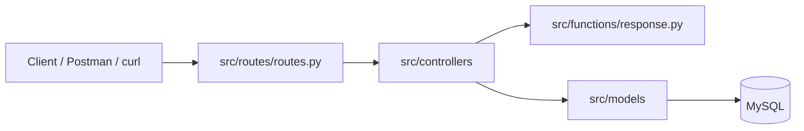

# Flask App v2

V2 在 V1 的基礎上重構為 **Flask Blueprint + MVC** 架構，並將資料持久化至 **MySQL**（PyMySQL）。所有 API 前綴為 `/api/v2`，且目前僅使用 **GET** 與 **POST** 兩種 HTTP 方法。

---

## Project Structure

```bash
flask_app-2/
├── app.py                  # v2 啟動入口
├── app_v1.py               # v1 舊版（保留，用於對照重構邏輯）
├── boot.sh                 # v2 啟動腳本（port 8080）
├── .env.example            # 環境變數範本
├── migrations/init.sql     # MySQL 建表腳本
├── requirements.txt
├── README.md               # v1 README
├── v2_README.md            # v2 README
└── src/
    ├── __init__.py         # create_app() 工廠與 Blueprint 註冊
    ├── configs/
    │   └── config.py       # 應用設定
    ├── routes/
    │   └── routes.py       # 全部路由註冊（Blueprint）
    ├── controllers/        # Controller：處理 request、驗證資料、呼叫 model、回傳 response
    │   ├── health_controller.py
    │   ├── product_controller.py
    │   └── user_controller.py
    ├── models/             # Model：資料存取層，只負責與 MySQL 溝通
    │   ├── database.py     # PyMySQL 連線
    │   ├── product.py
    │   └── user.py
    └── functions/
        └── response.py     # 統一 JSON 回應格式
```

---

## Architecture Flow




### Layer Responsibilities


| Layer           | Responsibility                                                                                                                                                                       |
| --------------- | ------------------------------------------------------------------------------------------------------------------------------------------------------------------------------------ |
| Routes          | 註冊 API URL，將請求導向對應 controller function (Register API URLs and route requests to the corresponding controller functions)                                                              |
| Controller      | 讀取 request、驗證輸入資料、呼叫 model、決定成功或錯誤回應 (Read the request, validate input data, call the model, and determine the success or error response)                                            |
| Model           | 取得 DB connection、建立 cursor、執行 SQL、fetch / commit、回傳資料給 controller (Obtain a database connection, create a cursor, execute SQL, fetch/commit data, and return data to the controller) |
| Response Helper | 統一成功與錯誤回應格式 (Standardize the format for success and error responses)                                                                                                                 |


---

## v1 vs v2 Difference


| 項目       | v1 (`app_v1.py`)       | v2                                        |
| -------- | ---------------------- | ----------------------------------------- |
| 架構       | 單檔 monolith            | Flask Blueprint + MVC                     |
| 資料儲存     | Python dictionary（記憶體） | MySQL（持久化資料）                              |
| API 前綴   | 無                      | `/api/v2`                                 |
| Response | 多數直接 `jsonify()`       | `success_response()` / `error_response()` |
| DB 操作    | 無                      | PyMySQL + SQL                             |
| HTTP 方法  | GET / POST             | GET / POST                                |
| 狀態碼      | 多數回 200                | 200 / 201 / 400 / 404 / 409               |


---

## Quickly Start

### Requirements

- Python 3.x
- MySQL 8.x

### Install and Run

```bash
# 1. Create virtual environment and install dependencies
python3 -m venv .venv
source .venv/bin/activate
pip install -r requirements.txt

# 2. Optional: create .env from example
cp .env.example .env

# 3. Initialize database
mysql -u root -p < migrations/init.sql

# 4. Start server
chmod +x boot.sh
./boot.sh
```

Default service URL:
`http://localhost:8080`

API base URL:
`http://localhost:8080/api/v2`

---

## Environment Variables

`.env` is optional. If it is not provided, the app uses default values from `src/configs/config.py`.


| Variable         | Description         | Default     |
| ---------------- | ------------------- | ----------- |
| `MYSQL_HOST`     | MySQL host          | `127.0.0.1` |
| `MYSQL_PORT`     | MySQL port          | `3306`      |
| `MYSQL_USER`     | MySQL user          | `root`      |
| `MYSQL_PASSWORD` | MySQL password      | empty       |
| `MYSQL_DATABASE` | MySQL database name | `MyShop`    |


---

## Unified Response Format

### Success Response

```json
{
  "success": true,
  "message": "Success message",
  "data": {}
}
```

If there is no data to return, `data` may be omitted.

### Error Response

```json
{
  "success": false,
  "message": "Error message"
}
```

---

## API Reference

Base URL:
`http://localhost:8080/api/v2`

### Endpoint Overview


| Method | Endpoint                              | Description                                      |
| ------ | ------------------------------------- | ------------------------------------------------ |
| GET    | `/healthCheck`                        | Health check                                     |
| GET    | `/products/list`                      | Get all products                                 |
| GET    | `/products/get-by-id/<product_id>`    | Get one product by ID                            |
| GET    | `/products/search`                    | Search products by JSON body (`name` or `price`) |
| POST   | `/products/create`                    | Create product                                   |
| POST   | `/products/update-by-id/<product_id>` | Update product by ID                             |
| POST   | `/products/delete/<product_id>`       | Delete product by ID                             |
| GET    | `/users/list`                         | Get all users                                    |
| GET    | `/users/search-by-id/<user_id>`       | Get one user by ID                               |
| POST   | `/users/create`                       | Create user                                      |
| POST   | `/users/update-by-id/<user_id>`       | Update user by ID                                |
| POST   | `/users/delete/<user_id>`             | Delete user by ID                                |


---

## Health Check

### `GET /healthCheck`

Check whether the service is running.

#### Success Response `200`

```json
{
  "success": true,
  "message": "I am healthy!",
  "version": "v2"
}
```

---

# Products API

## Get Product List

### `GET /products/list`

Retrieve all products from MySQL.

#### Success Response `200`

```json
{
  "success": true,
  "message": "Products retrieved successfully",
  "data": [
    {
      "id": 1,
      "name": "apple",
      "price": "20.00",
      "description": "Fresh red apple",
      "stock": 100,
      "created_at": "2026-06-17T10:00:00",
      "updated_at": "2026-06-17T10:00:00"
    }
  ]
}
```

---

## Get Product by ID

### `GET /products/get-by-id/<product_id>`

Retrieve one product by product ID.

#### Success Response `200`

```json
{
  "success": true,
  "message": "Product retrieved successfully",
  "data": {
    "id": 1,
    "name": "apple",
    "price": "20.00",
    "description": "Fresh red apple",
    "stock": 100,
    "created_at": "2026-06-17T10:00:00",
    "updated_at": "2026-06-17T10:00:00"
  }
}
```

#### Error Response `404`

```json
{
  "success": false,
  "message": "Product not found"
}
```

---

## Search Products

### `GET /products/search`

Search products by request JSON body.

> Current implementation reads search conditions from `request.json`. Therefore the curl examples below use `GET` with JSON body.

### Search by name

#### Request Body

```json
{
  "name": "apple"
}
```

#### Success Response `200`

```json
{
  "success": true,
  "message": "Product found successfully",
  "data": [
    {
      "id": 1,
      "name": "apple",
      "price": "20.00",
      "description": "Fresh red apple",
      "stock": 100
    }
  ]
}
```

### Search by price

`price` must use this format:

```text
">= value" or "<= value"
```

#### Request Body

```json
{
  "price": "<= 40"
}
```

#### Success Response `200`

```json
{
  "success": true,
  "message": "Products retrieved successfully",
  "data": [
    {
      "id": 1,
      "name": "apple",
      "price": "20.00"
    },
    {
      "id": 3,
      "name": "orange",
      "price": "30.00"
    }
  ]
}
```

#### Error Response `400`

```json
{
  "success": false,
  "message": "Price format must be '>= value' or '<= value'"
}
```

```json
{
  "success": false,
  "message": "Invalid price operator"
}
```

---

## Create Product

### `POST /products/create`

Create a new product in MySQL.


| Field         | Required | Description                           |
| ------------- | -------- | ------------------------------------- |
| `name`        | Yes      | Product name                          |
| `price`       | Yes      | Product price. It cannot be negative. |
| `description` | No       | Product description                   |
| `stock`       | No       | Product stock. Default value is `0`.  |


#### Request Body

```json
{
  "name": "kiwi",
  "price": 75,
  "description": "Fresh kiwi",
  "stock": 30
}
```

#### Success Response `201`

```json
{
  "success": true,
  "message": "Product created successfully",
  "data": {
    "id": 4,
    "name": "kiwi",
    "price": "75.00",
    "description": "Fresh kiwi",
    "stock": 30
  }
}
```

#### Error Response `400`

```json
{
  "success": false,
  "message": "Name is required"
}
```

```json
{
  "success": false,
  "message": "Price is required"
}
```

```json
{
  "success": false,
  "message": "Price cannot be negative"
}
```

---

## Update Product

### `POST /products/update-by-id/<product_id>`

Update product data by product ID. Partial update is supported, so only provided fields will be changed.

#### Request Body

```json
{
  "price": 80,
  "stock": 25
}
```

#### Success Response `200`

```json
{
  "success": true,
  "message": "Product updated successfully",
  "data": {
    "id": 4,
    "name": "kiwi",
    "price": "80.00",
    "description": "Fresh kiwi",
    "stock": 25
  }
}
```

#### Error Response `400`

```json
{
  "success": false,
  "message": "Price cannot be negative"
}
```

#### Error Response `404`

```json
{
  "success": false,
  "message": "Product not found"
}
```

---

## Delete Product

### `POST /products/delete/<product_id>`

Delete product by product ID.

#### Success Response `200`

```json
{
  "success": true,
  "message": "Product deleted successfully"
}
```

#### Error Response `404`

```json
{
  "success": false,
  "message": "Product not found"
}
```

---

# Users API

## Get User List

### `GET /users/list`

Retrieve all users from MySQL.

#### Success Response `200`

```json
{
  "success": true,
  "message": "Users retrieved successfully",
  "data": [
    {
      "id": 3,
      "name": "Margo",
      "email": "margo.cococo@mail.com",
      "phone": "0897654321",
      "created_at": "2026-06-24T03:47:10",
      "updated_at": "2026-06-24T03:47:10"
    }
  ]
}
```

---

## Get User by ID

### `GET /users/search-by-id/<user_id>`

Retrieve one user by user ID.

#### Success Response `200`

```json
{
  "success": true,
  "message": "User retrieved successfully",
  "data": {
    "id": 3,
    "name": "Margo",
    "email": "margo.cococo@mail.com",
    "phone": "0897654321",
    "created_at": "2026-06-24T03:47:10",
    "updated_at": "2026-06-24T03:47:10"
  }
}
```

#### Error Response `404`

```json
{
  "success": false,
  "message": "User not found"
}
```

---

## Create User

### `POST /users/create`

Create a new user in MySQL.


| Field   | Required | Description                                           |
| ------- | -------- | ----------------------------------------------------- |
| `name`  | Yes      | User name. Must be string.                            |
| `email` | Yes      | User email. Must be unique and contain `@`.           |
| `phone` | No       | Phone number. If provided, it must contain 10 digits. |


#### Request Body

```json
{
  "name": "Margo",
  "email": "margo.cococo@mail.com",
  "phone": "0897654321"
}
```

#### Success Response `201`

```json
{
  "success": true,
  "message": "User created successfully",
  "data": {
    "id": 3,
    "name": "Margo",
    "email": "margo.cococo@mail.com",
    "phone": "0897654321"
  }
}
```

#### Error Response `400`

```json
{
  "success": false,
  "message": "Name is required"
}
```

```json
{
  "success": false,
  "message": "Email is required"
}
```

```json
{
  "success": false,
  "message": "Invalid email format"
}
```

```json
{
  "success": false,
  "message": "Phone must contain 10 digits"
}
```

#### Error Response `409`

```json
{
  "success": false,
  "message": "User already exists"
}
```

---

## Update User

### `POST /users/update-by-id/<user_id>`

Update user data by user ID. Partial update is supported.

#### Request Body

```json
{
  "phone": "0987654321"
}
```

#### Success Response `200`

```json
{
  "success": true,
  "message": "User updated successfully",
  "data": {
    "id": 3,
    "name": "Margo",
    "email": "margo.cococo@mail.com",
    "phone": "0987654321"
  }
}
```

#### Error Response `404`

```json
{
  "success": false,
  "message": "User not found"
}
```

---

## Delete User

### `POST /users/delete/<user_id>`

Delete user by user ID.

#### Success Response `200`

```json
{
  "success": true,
  "message": "User deleted successfully"
}
```

#### Error Response `404`

```json
{
  "success": false,
  "message": "User not found"
}
```

---

# curl Examples

Base URL:

```bash
BASE_URL="http://localhost:8080/api/v2"
```

## Health Check

```bash
curl "$BASE_URL/healthCheck"
```

---

## Products

### Get all products

```bash
curl "$BASE_URL/products/list"
```

### Get product by ID

```bash
curl "$BASE_URL/products/get-by-id/1"
```

### Search products by name

```bash
curl -X GET "$BASE_URL/products/search" \
  -H "Content-Type: application/json" \
  -d '{"name": "apple"}'
```

### Search products by price

```bash
curl -X GET "$BASE_URL/products/search" \
  -H "Content-Type: application/json" \
  -d '{"price": "<= 40"}'
```

### Create product

```bash
curl -X POST "$BASE_URL/products/create" \
  -H "Content-Type: application/json" \
  -d '{
    "name": "kiwi",
    "price": 75,
    "description": "Fresh kiwi",
    "stock": 30
  }'
```

### Update product

```bash
curl -X POST "$BASE_URL/products/update-by-id/1" \
  -H "Content-Type: application/json" \
  -d '{
    "price": 80,
    "stock": 25
  }'
```

### Delete product

```bash
curl -X POST "$BASE_URL/products/delete/1"
```

---

## Users

### Get all users

```bash
curl "$BASE_URL/users/list"
```

### Get user by ID

```bash
curl "$BASE_URL/users/search-by-id/1"
```

### Create user

```bash
curl -X POST "$BASE_URL/users/create" \
  -H "Content-Type: application/json" \
  -d '{
    "name": "enrique",
    "email": "ricco.cococo@gomail.com",
    "phone": "0897654399"
  }'
```

### Create user without phone

```bash
curl -X POST "$BASE_URL/users/create" \
  -H "Content-Type: application/json" \
  -d '{
    "name": "anastasia",
    "email": "fabilous777@gmail.com"
  }'
```

### Update user

```bash
curl -X POST "$BASE_URL/users/update-by-id/5" \
  -H "Content-Type: application/json" \
  -d '{
    "phone": "0997678399"
  }'
```

### Delete user

```bash
curl -X POST "$BASE_URL/users/delete/1"
```

---

## Database Schema

`migrations/init.sql` creates database `MyShop` and two tables: `products` and `users`.

### products


| Field         | Type          | Description                 |
| ------------- | ------------- | --------------------------- |
| `id`          | INT           | Primary key, auto increment |
| `name`        | VARCHAR(100)  | Product name                |
| `price`       | DECIMAL(10,2) | Product price               |
| `description` | TEXT          | Product description         |
| `stock`       | INT           | Product stock, default `0`  |
| `created_at`  | TIMESTAMP     | Created time                |
| `updated_at`  | TIMESTAMP     | Updated time                |


### users


| Field        | Type         | Description                 |
| ------------ | ------------ | --------------------------- |
| `id`         | INT          | Primary key, auto increment |
| `name`       | VARCHAR(100) | User name                   |
| `email`      | VARCHAR(255) | User email, unique          |
| `phone`      | VARCHAR(20)  | User phone, nullable        |
| `created_at` | TIMESTAMP    | Created time                |
| `updated_at` | TIMESTAMP    | Updated time                |


The initialization script inserts three default products: `apple`, `banana`, and `orange`.